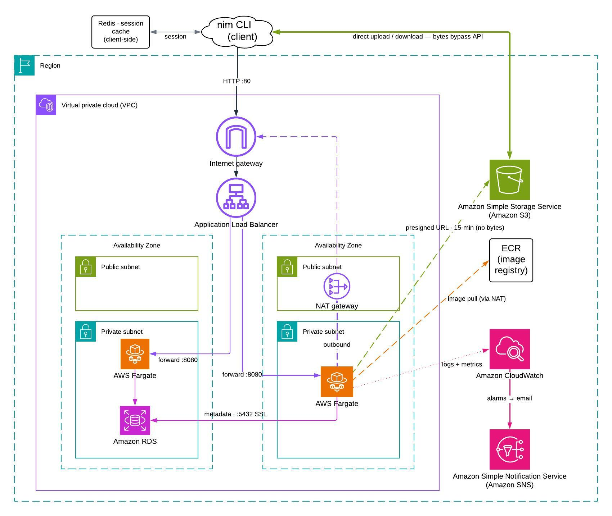

<h1 align="center">☁️ Nimbus CLI</h1>

<p align="center">
  <strong>A cloud file-storage platform you drive entirely from your terminal.</strong><br>
  Go CLI + REST API · direct-to-S3 transfers · PostgreSQL metadata · Redis sessions ·
  containerized and deployed on AWS ECS Fargate via Terraform.
</p>

<p align="center">
  <a href="#project-status"></a>
  
  <a href=".github/workflows/main.yml"></a>
  
  
  
</p>

---

## Why this project exists

Most side projects stop at "it works on my machine." Nimbus was built to answer a
harder question: **what does it actually take to ship a secure, multi-user cloud
service end to end?** Every layer — the CLI, the stateless API, the auth model,
the AWS infrastructure, and the CI/CD that guards it — was designed, built, and
owned from scratch.

The result is a system that mirrors how real SaaS products work under the hood,
with the trade-offs made deliberately rather than by accident.

### What this demonstrates

| Area | Highlights |
| --- | --- |
| **Distributed systems** | Stateless API; file bytes bypass the server entirely via presigned S3 URLs; metadata in PostgreSQL kept in sync with object storage |
| **Security engineering** | Bcrypt (cost 14), JWT with `alg:none` rejection, per-IP + per-email rate limiting, timing-attack-resistant auth, passkey-based password reset, non-sequential IDs, per-request ownership checks |
| **Cloud infrastructure** | Full AWS stack as Terraform IaC — VPC across 2 AZs, ECS Fargate (HA), ALB, RDS PostgreSQL, ECR, NAT Gateway, CloudWatch + SNS alarms, S3-backed remote state with DynamoDB locking |
| **CI/CD & quality** | GitHub Actions pipeline gating every PR: lint, race-tested units, build, dependency-CVE scan, secret scan — with branch protection ([overview](.github/workflows/README.md) · [deep dive](.github/CICD.md)) |
| **Developer experience** | Filesystem-style commands (`cd`, `ls`, `pwd`), live progress bars and spinners, Docker Compose for a one-command local stack |

---

## How it works

```text
   Your terminal (nim CLI)
            │  HTTPS
            ▼
   ┌──────────────────────┐        presigned URL (returned to CLI)
   │  ALB  (AWS)           │ ───────────────────────────────────────┐
   └──────────┬───────────┘                                         │
              │ :8080                                               │
              ▼                                                     ▼
   ┌──────────────────────┐        metadata          ┌──────────────────────┐
   │  API  (Go / Gin)     │ ───────────────────────► │  RDS PostgreSQL       │
   │  on ECS Fargate ×2   │                          └──────────────────────┘
   └──────────┬───────────┘
              │ auth + ownership only
              ▼
   ┌──────────────────────┐        direct upload/download (CLI ⇄ S3)
   │  AWS S3              │ ◄──────────────────────────────────────────────┐
   └──────────────────────┘                                                │
                                                        (bytes never touch the API)
```

**The key design decision:** file data never flows through the API server. The
server authenticates the request, verifies you own the target box, generates a
short-lived presigned S3 URL, and hands it back. The CLI then streams the file
directly to or from S3. This keeps the API fast, cheap, and horizontally
scalable — it only ever moves small JSON, never gigabytes of user data.

Redis on the client side caches your session so you stay logged in between
commands, which is what lets the API stay fully stateless.

---

## Infrastructure (AWS, as Terraform IaC)

The production environment is defined entirely as code with Terraform — modular,
reproducible, and version-controlled. State is stored in an **S3 backend with
DynamoDB locking** so infrastructure changes are safe to apply as a team.

<p align="center">
  
</p>

**What's provisioned** (four Terraform modules: `networking`, `compute`,
`database`, `monitoring`):

| Layer | Resources |
| --- | --- |
| **Networking** | VPC (`10.0.0.0/16`), 2 public + 2 private subnets across 2 AZs, Internet Gateway, NAT Gateway + Elastic IP, route tables |
| **Compute** | ECS Fargate cluster running **2 API tasks** for high availability (private subnets, no public IPs), Application Load Balancer, ECR image registry, IAM task-execution role, tiered security groups |
| **Database** | RDS PostgreSQL 15, private DB subnet group, security group locked to **ECS traffic only**, SSL required |
| **Monitoring** | CloudWatch alarms on ECS CPU, RDS CPU, and ALB 5XX rate → SNS email notifications; 7-day container log retention |

**Security posture baked into the network:** the API tasks have **no public IP**
and live in private subnets — the only inbound path is `Internet → ALB → ECS on
:8080`, and the database only accepts connections from the ECS security group.
Outbound access (e.g. pulling container images) is routed through a NAT Gateway.

> Deploy flow: build the API image → push to **ECR** → ECS Fargate rolls out the
> new task definition behind the ALB, which health-checks `/health` before
> routing traffic.

---

## Security Highlights

Built to production standards, not just to pass a code review:

- **Passwords** are hashed with bcrypt (cost 14) and require uppercase, lowercase, number, and special character
- **Passkey-based password reset** — a per-user 4-character passkey (set at registration, bcrypt-hashed) authorizes a self-service reset, with no email/SMS channel required
- **JWT tokens** expire after 24 hours — every request is verified before anything happens; non-HMAC (`alg:none`) tokens are rejected
- **Ownership checks** on every operation — you can only touch your own boxes and files
- **Timing-attack mitigation** — login and password reset always take the same time whether the account exists or not, so attackers can't probe for valid emails
- **Non-sequential IDs** — user and box IDs are randomly generated, not `1, 2, 3...`, which prevents enumeration
- **Rate limiting** — the login and password-reset endpoints are throttled per-IP **and** per-email (5 attempts / 15 min) by in-app middleware, so brute force is slowed even from rotating IPs
- **Presigned S3 URLs** — file transfers go directly to S3 with time-limited, scoped credentials (15-min expiry)
- **Audit logging** — failed logins and reset attempts are logged with IP; file operations log user, size, and duration

---

## Data Model

Everything is organized in a three-tier hierarchy:

```text
User
└── Box: "my-project"
    ├── Folder: "documents"
    │   └── resume.pdf
    └── Folder: "code"
        ├── Folder: "nimbus"
        │   └── main.go
        └── notes.txt
```

When you register, a default "Home-Box" is created automatically. You can create more boxes, organize files into folders, and navigate the hierarchy just like a local filesystem.

---

## CLI Commands

| Command | What it does |
| --- | --- |
| `nim register` | Open the registration page to create an account (email, password, passkey) |
| `nim login` | Sign in (prompts for email and password; type `r` at the email prompt to reset your password via passkey) |
| `nim logout` | Sign out and clear local session |
| `nim mkbox <name>` | Create a new box |
| `nim rmbox <name>` | Delete a box and all its contents |
| `nim bls` | List all your boxes |
| `nim cb <name>` | Switch to a box |
| `nim cdir <name> [destination]` | Create a folder in the current box |
| `nim ls [path]` | List files and folders |
| `nim cd <path>` | Navigate into a folder (supports `..` and `/absolute/paths`) |
| `nim pwd` | Show your current location |
| `nim post -f <file> [-d <dest>]` | Upload a file (direct to S3 via presigned URL) |
| `nim get -f <key> [-o <output>]` | Download a file (direct from S3 via presigned URL) |
| `nim del -f <key>` | Delete a file |
| `nim rename --key <key> --name <new>` | Rename a file |
| `nim mv --key <key> --to <folder>` | Move a file to a different folder |
| `nim rmdir <name>` | Delete a folder and all its contents |
| `nim mvdir <name> <new-name>` | Rename a folder |

### Example Session

```bash
nim login
nim mkbox my-project
nim cb my-project
nim cdir documents
nim post -f resume.pdf -d documents/resume.pdf
nim ls
# [dir]  documents/
# [file] resume.pdf    145 KB
nim rename --key users/.../resume.pdf --name cv.pdf
nim logout
```

---

## Quick Start

**Prerequisites:** Go 1.26+, Docker, Redis

```bash
# 1. Clone and start local services (PostgreSQL + S3 emulator)
git clone <repo-url> && cd nim-cli
docker compose up -d

# 2. Configure the server — create a .env file (see utils/getEnv.go for lookup order)
# LOCAL_DEV=true
# DATABASE_URL=host=localhost user=nimbus password=nimbus dbname=nimbus port=5432 sslmode=disable
# AWS_REGION=us-east-1
# S3_BUCKET=nimbus-storage
# S3_ENDPOINT=http://localhost:4566          # read by the AWS SDK for LocalStack
# S3_FORCE_PATH_STYLE=true                    # read by the AWS SDK for LocalStack
# JWT_SECRET=your-secret-key                  # required; use a long random value
# CORS_ORIGINS=http://localhost:3000          # optional; wildcard "*" if unset

# 3. Start the API server (listens on :8080)
cd server && go run main.go

# 4. Build and run the CLI
cd client && go build -o nim cli/main.go
./nim --help
```

---

## Tech Stack

| Layer | Technology |
| --- | --- |
| CLI | Go · Cobra · progressbar (live progress UI) |
| API Server | Go · Gin |
| Database | PostgreSQL · GORM (RDS in production) |
| File Storage | AWS S3 · LocalStack for local dev (presigned URLs) |
| Session Cache | Redis |
| Compute | AWS ECS Fargate (2 tasks, HA) behind an ALB |
| Infrastructure | Terraform (VPC, Fargate, RDS, ECR, NAT, CloudWatch, SNS) · S3 + DynamoDB remote state |
| CI/CD | GitHub Actions — lint, race-tested tests, build, govulncheck, gitleaks |
| Local Dev | Docker Compose (PostgreSQL + LocalStack S3) |

---

## Project Status

**Nimbus is under active development.**

Done:

- User registration and login with JWT
- Passkey-based password reset from `nim login`
- Per-IP + per-email rate limiting on login and password reset
- File upload, download, delete, rename, and move
- Presigned S3 URLs — file data never passes through the server
- Folder creation, deletion, rename, listing, and zip download
- Box creation, deletion, and listing
- Full path navigation (`cd`, `pwd`, `ls`)
- Live progress bars and spinners on all CLI commands
- Comprehensive server-side tests (handlers, auth, file ops, box ops)
- ALB-ready server — trusted proxy headers, CORS config, HTTP timeouts
- Production AWS infrastructure as Terraform IaC (ECS Fargate, RDS, ALB, VPC, monitoring)
- CI/CD pipeline gating every PR (see [.github/workflows/README.md](.github/workflows/README.md))

Planned:

- File versioning
- Sharing and collaboration
- Cross-platform build scripts and releases
- Production hardening items tracked in the internal readiness review

---

## License

MIT
